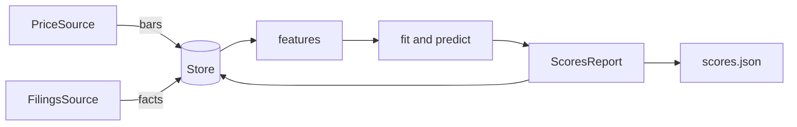

# Architecture

index is a
[uv workspace](https://docs.astral.sh/uv/concepts/projects/workspaces/) of three
Python packages and an Astro site.

```text
├── packages/
│   ├── core/   index-core: sources, store, features, model, backtest
│   ├── cli/    index-cli: the `eq` command
│   └── api/    index-api: read-only FastAPI over the SQLite file
├── api/        Vercel entrypoint that serves index-api under /api
├── universes/  ticker lists, one per line
├── web/        Astro site that renders outputs/scores.json
├── docs/       the manual
├── scripts/    deploy-data.sh, the scores the deployed page and API show
├── .github/    contributing guide and the CI workflow
├── pyproject.toml   workspace members, ruff, mypy and pytest settings
├── vercel.json      how Vercel builds the page and routes /api
└── mise.toml        tool versions and tasks
```

`index-core` holds all the logic as functions over data and has no interface.
`index-cli` and `index-api` call into it and add arguments, formatting and HTTP.
`web` does not import Python. It reads the JSON file that `eq run` writes, and
the browser refreshes it from the API.

## A run



[`pipeline.run`](../packages/core/index_core/pipeline.py) is the whole path:
`ingest` and `ingest_filings` write to the store, `score` reads it back, builds
features, fits and predicts, and `Store.save_report` keeps the result.
`eq backtest` and `eq coverage` read the same store and fetch nothing.

## Boundaries

- **The network.** Only the sources in
  [`sources/`](../packages/core/index_core/sources) touch it. A `PriceSource` is
  Tiingo or synthetic, and a `FilingsSource` is EDGAR or synthetic. Both are
  protocols in [`sources/base.py`](../packages/core/index_core/sources/base.py).
  The pipeline sees only the protocols.
- **The database.** Only [`store.py`](../packages/core/index_core/store.py)
  speaks SQL. It enforces one price source and one filings source per file.
- **Time.** A feature at day `t` reads data available on day `t`. A label reads
  the following 64 days, and the training split drops rows whose label window
  overlaps the holdout or the test quarter.
- **The report shape.** [`report.py`](../packages/core/index_core/report.py)
  defines `ScoresReport`. The store, `scores.json` and the API all use it.

## Modules of index-core

| Module                                 | Responsible for                                        |
| -------------------------------------- | ------------------------------------------------------ |
| `pipeline.py`                          | `run`, `score`, `backtest` and `coverage` over a store |
| `sources/base.py`                      | The source protocols, price columns and fact columns   |
| `sources/tiingo.py`                    | Tiingo daily prices                                    |
| `sources/edgar.py`                     | EDGAR `companyfacts`, the concept and tag table        |
| `sources/synthetic.py`                 | Deterministic fake prices and filings                  |
| `store.py`                             | SQLite schema, reads, writes and the source guard      |
| `universe.py`                          | Reading a ticker list                                  |
| `features/technical.py`                | The 20 technical features                              |
| `features/fundamental.py`              | Facts to trailing figures to the 14 ratios             |
| `features/normalize.py`                | Percentile rank within each date                       |
| `labels.py`                            | The excess-return label                                |
| `model.py`                             | Snapshots, the purged split, LightGBM, AUC             |
| `scoring.py`                           | Probabilities to ranks and decile scores               |
| `walkforward.py`                       | Quarterly refits and out-of-sample predictions         |
| `evaluation.py`                        | Rank IC, hit rates and block-bootstrap intervals       |
| `report.py`                            | `ScoresReport`                                         |
| `backtest_text.py`, `coverage_text.py` | The text that `eq backtest` and `eq coverage` print    |

For the model, fundamentals and backtest behavior, see [Model](MODEL.md),
[Fundamentals](FUNDAMENTALS.md) and [Backtest](BACKTEST.md).

## Tests

Tests sit beside each package in `packages/*/tests`. They run on synthetic data
and on EDGAR payloads in
[`packages/core/tests/fixtures`](../packages/core/tests/fixtures), and they
train real models. See [Contributing](../.github/CONTRIBUTING.md#tests).
